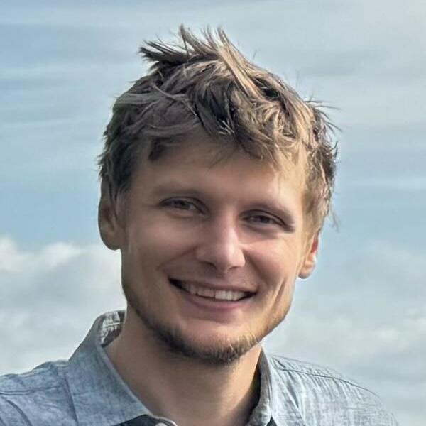
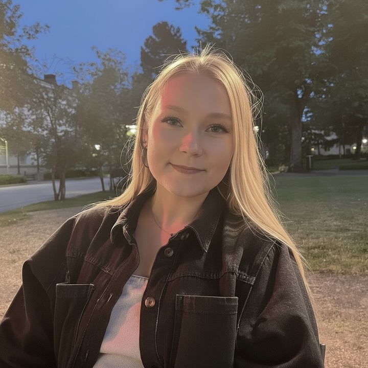
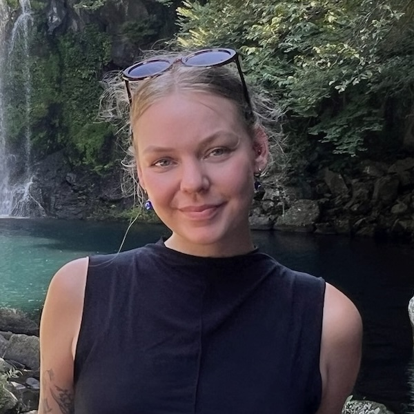
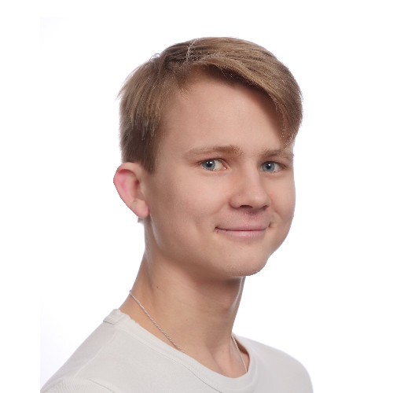
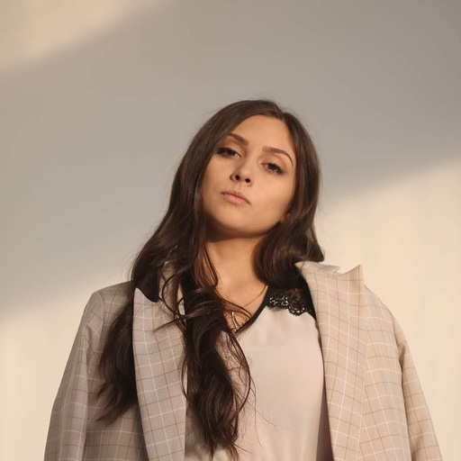
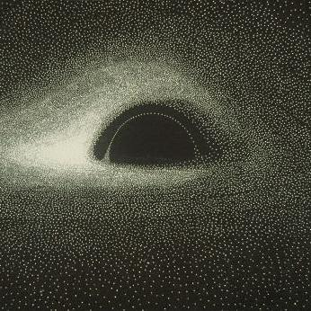
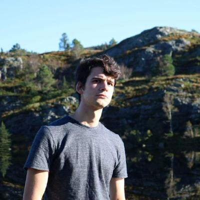
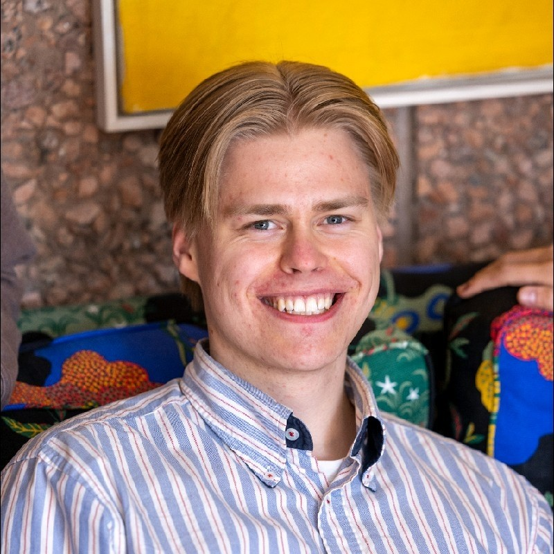
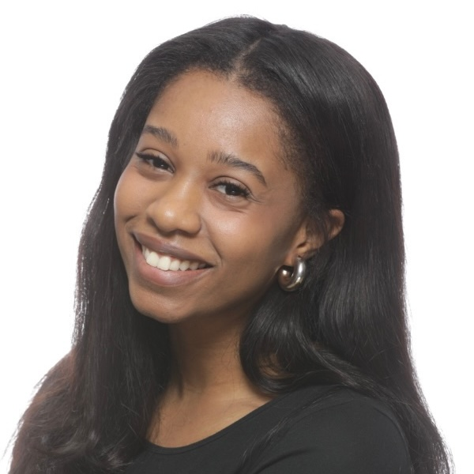

::: full-width

**Stéphane Deny - Principal Investigator [[website](https://sites.google.com/view/stephanedeny/home)]**
As philospher Émile-Auguste Chartier used to say: "Nothing is more dangerous than an idea, when it's the only one you have".
:::

## Doctoral Researchers

::: columns

**Riina Pöllänen**
Visual object representations  
Neural dynamics  
MEG & Computational modeling  

**Netta Ollikka**
Now hopefully happy with the layout 😇

**Akseli Pullinen**
Extending 3D scenes  

**Alina Popadina**
Popping out  
Psychophysics

**Raymond Khazoum [[website](https://rkhz.github.io)]**
Mental rotation  
Neurosymbolic computing

**Andrea Perin [[website](https://andrea-perin.github.io)]**
Symmetries  
Kernel methods  
Local learning rules  
:::

## Interns and Research Assistants

::: columns

**Sebastian Hannula**
Self-supervising stringy donuts

**Imose Iduozee**
TODO
:::

## Alumni

* **Matias Koponen**
* **Alexandr Krylov**
* **Minh Ðinh Trọng**
* **Camille Begon**
* **Erwan David**
* **Qin Li**
* **Oskar Reivinen**
* **Bernard Spiegl**
* **Raihan Gafur** [[website](https://raihanthecooldude.com/)]
