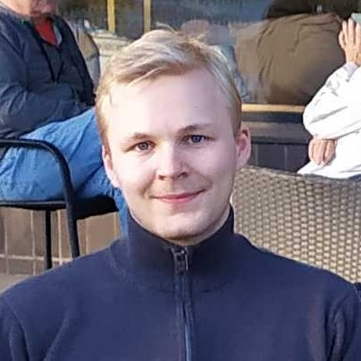
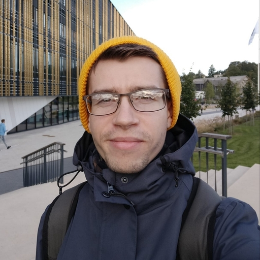
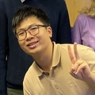
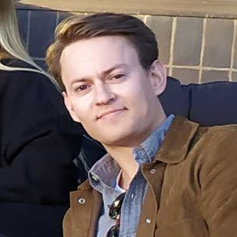
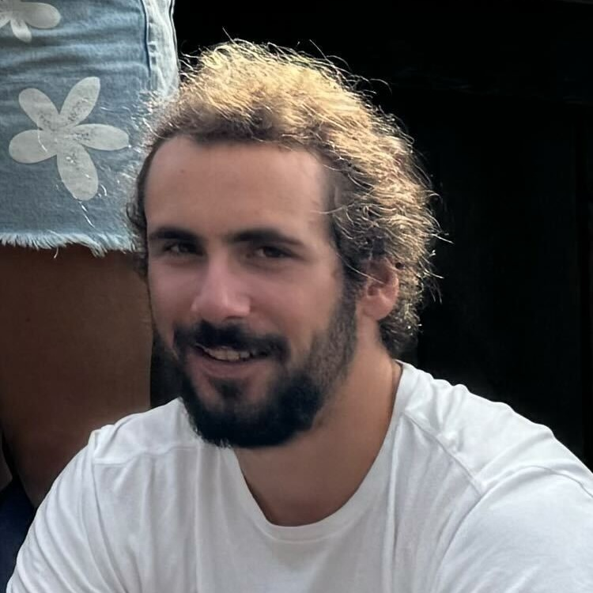

::: full-width

**Stéphane Deny - Principal Investigator [[website](https://sites.google.com/view/stephanedeny/home)]**
It is a long established fact that a reader will be distracted by the readable content of a page when looking at its layout. The point of using Lorem Ipsum is that it has a more-or-less normal distribution of letters, as opposed to using 'Content here, content here', making it look like readable English. Many desktop publishing packages and web page editors now use Lorem Ipsum as their default model text, and a search for 'lorem ipsum' will uncover many web sites still in their infancy. Various versions have evolved over the years, sometimes by accident, sometimes on purpose (injected humour and the like).
:::

## Doctoral Researchers

::: columns

**Riina Pöllänen**
Visual object representations  
Neural dynamics  
MEG & Computational modeling  

**Netta Ollikka**
Now hopefully happy with the layout 😇

**Akseli Pullinen**
Extending 3D scenes  

**Alina Popadina**
Popping out  
Psychophysics

**Raymond Khazoum [[website](https://rkhz.github.io)]**
Mental rotation  
Neurosymbolic computing

**Andrea Perin [[website](https://andrea-perin.github.io)]**
Symmetries  
Kernel methods  
Local learning rules  
:::

## Interns and Research Assistants

::: columns

**Sebastian Hannula**
Self-supervising stringy donuts

**Imose Iduozee**
TODO
:::

## Alumni

::: columns

**Matias Koponen**
Math guy extraordinaire

**Alexandr Krylov**
Metzler shapes and GPs

**Minh Ðinh Trọng**
The prodigy

**Oskar Asser "Reivi" Reivinen**
Vegan

**Bernard Spiegl**
He's teaching CERN how to do ML

**Raihan Gafur [[website](https://raihanthecooldude.com/)]**
Playing 4D chess
:::
